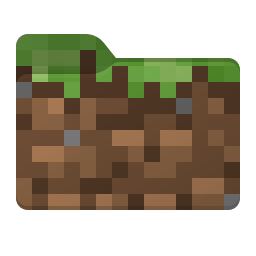

# BuildPaste (Fabric, NeoForge, Server)

Paste builds from [buildpaste.net](https://buildpaste.net) straight into your world.
Select two corners, upload what you built, and paste any build back in — turned to
face whichever way you are looking.

A **server-side** mod for **Fabric** and **NeoForge**, built from one codebase.

## About this fork

This is a fork of [BuildPaste](https://legacy.curseforge.com/minecraft/bukkit-plugins/buildpaste),
a Bukkit server plugin by **MistrX**.

The reason is simple: the original only exists as a Bukkit/Spigot plugin, and I don't run
Bukkit. My server and my client are NeoForge, so the plugin could not be installed on
either — a Bukkit plugin and a mod share no code at all, so carrying it across meant
rewriting it against the mod loaders' APIs. What it does, how its commands read, and the
buildpaste.net protocol it speaks are unchanged: builds uploaded by the original plugin
paste correctly here, and builds uploaded here work anywhere else BuildPaste runs.

The name says what the fork adds, because that is the whole point of it: **Fabric**,
**NeoForge**, and **Server** — it runs on a server without its players needing to install
anything.

It is dedicated to my son, who would rather spend an afternoon building a castle than
fighting anything that lives in one :)

## Usage

Select a region, look at the front of your build, and upload it:

```
/pos1                    set the first corner (or left-click with the selector)
/pos2                    set the second corner (or right-click with the selector)
/selector                get the position selector stick
/removepos               clear both corners
/upload [name]           upload the selected region
```

Paste builds back in, oriented to the way you are facing:

```
/paste                          paste the build selected on buildpaste.net
/paste <build-id>               paste a particular build
/paste <build-id> dontplaceair  drop the build into the scene, keeping what is already there
/undopaste                      put back whatever the last paste overwrote
```

Build from your own inventory instead of pasting outright:

```
/construct [build-id]    list the materials the build needs and what you are missing
/construct confirm       build as much of it as your inventory pays for
```

Share and select builds:

```
/setbuild <build-id>     make a build your selected one
/sharebuild [build-id]   post a clickable paste link to everyone on the server
/pastepaper [name]       get a piece of paper that pastes your selected build on right-click
/connectaccounts [email] link your Minecraft account to your buildpaste.net account
```

Operator settings:

```
/buildpaste                                          what this is, with example links
/buildpaste allowall | disallowall                   let everyone use it, or not
/buildpaste pastePermission <player> allow|disallow  grant one player one permission
/buildpaste uploadPermission <player> allow|disallow
/buildpaste constructPermission <player> allow|disallow
/buildpaste allPermissions <player> allow|disallow
/buildpaste debug true|false                         trace pastes in the server log
```

Operators may do everything by default. Anyone else needs a grant, and grants last until
the server restarts.

## Installing

Get the jar for your loader from
[Modrinth](https://modrinth.com/mod/buildpaste-fabric-neoforge-server) or the
[releases page](https://github.com/GaborWnuk/buildpaste/releases) —
`buildpaste-fabric-*.jar` or `buildpaste-neoforge-*.jar` — and drop it in your `mods`
folder along with the dependencies below.

### Dependencies

| Loader   | Required alongside BuildPaste                                                                                                              |
| -------- | ------------------------------------------------------------------------------------------------------------------------------------------ |
| Fabric   | [Fabric API](https://modrinth.com/mod/fabric-api) and [Fabric Language Kotlin](https://modrinth.com/mod/fabric-language-kotlin) (1.13.12+)   |
| NeoForge | [Kotlin for Forge](https://github.com/thedarkcolour/KotlinForForge) 6.3.0 or newer                                                            |

Both loaders also need **Java 25**, which is what Minecraft 26.1 itself requires.

The mod declares these in its metadata, so a loader will tell you what is missing rather
than crashing. Nothing else is bundled — there are no shaded libraries, and JSON handling
uses the Gson the game already ships.

### Where to install it

The mod is **server-side**, which is the third word in its name. It registers no blocks,
items, entities or network channels, so:

- On a **server**, it is the only place it needs to be installed. Players can join with an
  unmodded client and still use every command — the commands and the chat buttons come
  from the server, and the selector and paste paper are an ordinary stick and an ordinary
  piece of paper with a name on them.
- On a **client**, install it to use the commands in your own singleplayer worlds.

A Fabric server and a NeoForge server each need their own loader's jar, but both speak the
same buildpaste.net protocol, so builds move freely between them.

## Supported versions

| Minecraft       | Loaders          | Where                                                       |
| --------------- | ---------------- | ----------------------------------------------------------- |
| 26.1.2 or newer | Fabric, NeoForge | this fork — tested on 26.1.2                                |
| 1.16 – 1.21.10  | Bukkit           | [the original plugin](https://legacy.curseforge.com/minecraft/bukkit-plugins/buildpaste) |

The mod declares a `26.1.2`+ version range, so loaders refuse to load it on an unsupported
version rather than crashing. Support for a newer Minecraft release is added by one
`match(...)` line in [settings.gradle.kts](settings.gradle.kts).

## What changed from the plugin

The fork is a rewrite against a different platform — Bukkit and the mod loaders share no
API — but it keeps the commands, the chat, and the wire protocol as they were. Along the
way it fixes a handful of defects in the original:

- **Requests no longer block the server.** Every backend call the plugin made ran
  synchronously inside the command handler, freezing the server for the length of the
  round trip. Calls are asynchronous here and resume on the server thread.
- **Uploading unusual blocks works.** The plugin called `equals` on a null block id, so
  uploading any block outside its 1140-name table threw and lost the whole upload.
  Untabled blocks now travel as their name.
- **Chests and signs keep their contents.** The protocol has always had a field for
  block-entity data, but the plugin sent it empty and ignored it on the way back, so
  every build it uploaded pasted hollow. It is captured and restored now. Data saved
  before Minecraft 1.21 is in a layout this version cannot read; those blocks are placed
  empty and reported rather than half-restored.
- **Undo restores what was there.** Undo re-applied the paste rotation to the blocks it
  had captured, so restored stairs and logs came back facing the wrong way.
- **Pasting over a build corrects it.** Placement compared only the block type, so a
  stair already in the right spot but facing the wrong way was left alone.
- **Blocks the game renamed still paste.** Five names in the shared table — `grass`,
  `grass_path`, `sign`, `wall_sign` and `chain` — no longer exist, and older builds came
  out with holes where they were.
- **Debug output goes to the log**, rather than being broadcast to every player on the
  server as chat.

## Building from source

Requirements: Java 25, which Gradle provisions automatically thanks to the Foojay
toolchain resolver.

```sh
./gradlew build
```

This builds both loaders; the jars land in `versions/26.1.2-fabric/build/libs/` and
`versions/26.1.2-neoforge/build/libs/`.

The two targets share one source tree. Loader-specific code lives behind Stonecutter
comments (`//? if fabric {`), and only the two entry points need them — everything else is
plain Minecraft API. To work on one loader in an IDE, switch the active target:

```sh
./gradlew "Set active project to 26.1.2-fabric"
./gradlew "Set active project to 26.1.2-neoforge"
```

Run `./gradlew "Reset active project"` before committing, so the tree goes back to a
consistent state.

Switching the active target rewrites the shared sources in place, which Gradle's
up-to-date checks do not notice — so **run `./gradlew clean build` after a switch**, or
the previous target's classes linger and you get a jar missing its entry point. A fresh
checkout, which is what CI builds, is never affected.

To run a development client or server:

```sh
./gradlew :26.1.2-fabric:runClient
./gradlew :26.1.2-neoforge:runServer
```

## Credits and licences

The original BuildPaste plugin and the buildpaste.net service are by **MistrX** — thank
you. This fork is not affiliated with or endorsed by them.

The mod's own code is licensed under the [MIT licence](LICENSE).

The icon is **not** covered by that licence. It is
["Minecraft Windows 11 Folder ICO PNG" by SimplexDesignss](https://www.deviantart.com/simplexdesignss/art/Minecraft-Windows-11-Folder-ICO-PNG-950630441),
used under the Creative Commons
[Attribution-NonCommercial-NoDerivatives 3.0](https://creativecommons.org/licenses/by-nc-nd/3.0/)
licence. It is redistributed unchanged, as that licence requires: it must not be resized,
recoloured or otherwise altered, and it must not be put to commercial use. The same notice
travels inside the jar, at `assets/buildpaste/ICON-LICENSE.txt`.
